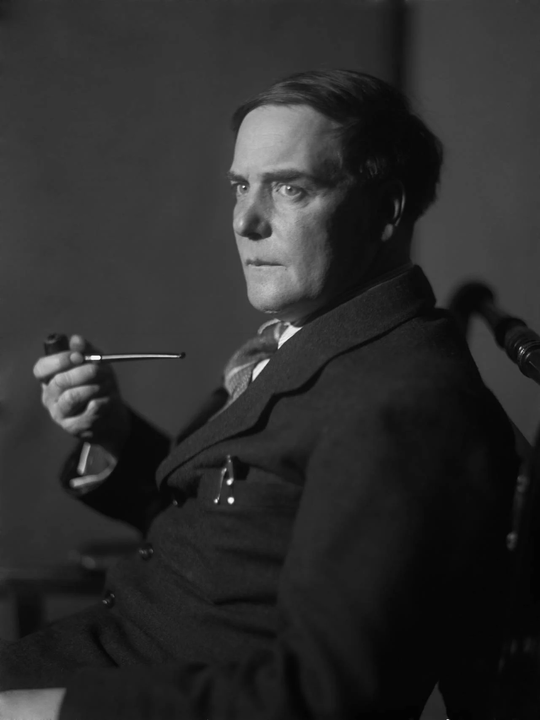

<!-- menu -->

|[Trang chủ](https://namlete102.github.io/Write-Collection-Mathematics/)|[Lưu trữ](https://namlete102.github.io/Write-Collection-Mathematics/archive.html)|[Thẻ](https://namlete102.github.io/Write-Collection-Mathematics/tag.html)|[Giới thiệu](https://namlete102.github.io/Write-Collection-Mathematics/about.html)|

<!-- title -->

    
        <h2>
            <b>Thư của Kapitsa về khoa học</b> 
            <a href="#">pdf</a>,
        </h2>
    

<!--  -->

    2024-12-31
    <a href="https://namlete102.github.io/Write-Collection-Mathematics/tag/physics.html" style="padding-right: 5px;">Vật lý</a>
    <a href="https://namlete102.github.io/Write-Collection-Mathematics/tag/collection.html" style="padding-right: 5px;">Sưu tập</a>
    <a href="https://namlete102.github.io/Write-Collection-Mathematics/tag/history.html" style="padding-right: 5px;">Lịch sử và góc nhìn</a>

<!-- contents -->

Từ lâu khi nhắc đến nền khoa học nước Nga, không thiếu những ngôi sao sáng cống hiến cho lịch sử khoa học thế giới trải dài trên nhiều lĩnh vực khác nhau. Tất cả những thành tựu đó không chỉ khẳng định vị thế của nước Nga trên bản đồ khoa học thế giới mà còn là nguồn cảm hứng vô tận cho các thế hệ khoa học gia tương lai. Hình ảnh những nhà khoa học Nga tận tụy, kiên trì vượt qua những khó khăn của thời đại để theo đuổi tri thức là minh chứng sống động cho sức mạnh của niềm đam mê và trí tuệ con người. Chính tinh thần ấy đã và đang truyền lửa cho các nhà khoa học trẻ, không chỉ ở Nga mà còn trên khắp thế giới, tiếp tục khám phá những chân trời tri thức mới, đóng góp vào sự tiến bộ chung của nhân loại.

Nhân dịp cuối năm 2024 này, xin gửi các bạn đọc những bức thư liên quan đến khoa học, giáo dục rất đáng đọc và vẫn còn giữ tính thời sự của nhà vật lý rất nổi tiếng người Nga **Pyotr Kapitsa** được dịch bởi nhà toán học Đàm Thanh Sơn.

    

Nhà vật lý Nga Pyotr Kapitsa

Pyotr Kapitsa (1894-1984) là một nhà vật lý rất nổi tiếng của Nga. Ông làm việc dưới sự hướng dẫn của Rutherford ở Cambridge, Anh, trong nhiều năm. Năm 1933 ông trở thành giám đốc đầu tiên của phòng thí nghiệm Mond. Năm 1934 ông bị giữ lại Nga trong một chuyến đi về Nga. Nhà nước Nga Xôviết mua lại toàn bộ thiết bị của phòng thí nghiệm của ông ở Anh và xây cho ông một Viện nghiên cứu mới, Viện các vấn đề vật lý, ở đó ông là giám đốc đầu tiên. Năm 1937 ông phát hiện ra tính siêu chảy của hêli lỏng, công trình sẽ được giải thưởng Nobel năm 1978. Trong những năm 1937-1938 đen tối ông là người cứu Fok và Landau ra khỏi tù. Trong chiến tranh thế giới thứ 2 ông phát hiện ra và đưa vào sản xuất một loại máy mới để chế tạo ôxy lỏng, và được trao danh hiệu Anh hùng lao động Liên Xô năm 1945. Do mâu thuẫn với Beria ông bị mất tất cả các chức vụ năm 1946. Ông được phục hồi chức giám đốc Viện các vấn đề Vật lý năm 1955.

Ông là người đầu tiên đưa ra ý tưởng thành lập một tạp chí chuyên về khoa học cho thế hệ trẻ, sau này chính là tạp chí Kvant

Nguồn của các bức thư được dịch ở đây :

Капица П.Л., Письма о науке, 1930-1980 – М.: Моск. рабочий, 1989.

## Trích thư Kapitsa gửi vợ, A.A.Kapitsa

**13 tháng 12 năm 1935, Moskva**

Hôm qua anh đánh cờ với Aleksei Nikolaevich Bakh. Cụ rất dễ mến, nhưng anh không đồng ý với cụ ở một điểm . . . Anh nói với cụ là tình trạng khoa học ở nước ta đang rất xấu, thì cụ bảo: *"Đúng thế, nhưng làm gì được, bây giờ có nhiều thứ quan trọng hơn là khoa học . . ."* Đây là một ví dụ điển hình của một nhà khoa học tự nguyện đẩy mình xuống hạng ưu tiên thứ nhì, thậm chí thứ ba. Anh cho rằng phải coi khoa học là một việc hết sức quan trọng và lớn lao, và cái inferiority complex này (tiếng Anh trong nguyên bản – mặc cảm tự ti, tự cho mình là không quan trọng) đang giết chết nền khoa học ở nước ta. Các nhà khoa học phải cố gắng chiếm vị trí hàng đầu trong việc phát triển văn hóa nước nhà và không lẩm bẩm "ở nước ta có những thứ quan trọng hơn". Đánh giá cái gì là quan trọng nhất, và cần phải chú ý đến khoa học kỹ thuật đến mức nào là công việc của các nhà lãnh đạo. Còn công việc của các nhà khoa học là tự tìm chỗ đứng của mình trong đất nước và trong chế độ mới, và không đợi người khác chỉ cho mình phải làm gì. Cái thái độ như vậy rất khó hiểu và xa lạ đối với anh . . .

Khi anh nói chuyện với nhiều nhà khoa học, anh rất ngạc nhiên khi họ tuyên bố "Cậu được nhiều như thế thì cậu làm gì chả dễ dàng . . ." Và cứ như thế. Họ cứ làm như là khi mới bắt đầu sự nghiệp, những cơ hội ban đầu của anh và của họ không giống nhau. Họ cứ làm như là những gì anh có là rơi từ trên trời xuống, không phải là do anh đã bỏ ra bao nhiêu công sức, bao nhiêu nơron thần kinh mới đạt được. Về khía cạnh này con người thật hèn hạ, họ cho rằng cuộc đời không công bằng, rằng xung quanh ai cũng có lỗi trừ họ. Nhưng đấu tranh làm gì, nếu không phải chính là để ta lợi dụng hoàn cảnh sẵn có quanh ta cho việc phát triển tài năng của mình và tạo điều kiện làm việc cho mình? Nếu chấp nhận quan điểm của Bakh và Co. thì không đi xa được . . .

## Bức thư cứu Landau

Nói thêm đôi chút về hoàn cảnh của bức thư . Khi ấy Landau bị bắt ngày 28/4/1938. Ngay hôm đó Kapitsa viết một bức thư cho Stalin, nhưng không có tác dụng. Sau bức thư trên đây, ngày 26/4/1939 Kapitsa được mời đến NKVD để viết đơn bảo lãnh cho Landau ra tù. Các hiện tượng mới được nhắc đến ở đầu bức thư trên là các hiện tượng liên quan đến tính siêu chảy. Landau xây dựng lý thuyết siêu chảy của hêli trong hai bài báo năm 1941 và 1947

**6 tháng 4 năm 1939**

Đồng chí Molotov,

Trong thời gian gần đây, khi nghiên cứu hêli lỏng ở gần độ không tuyệt đối, tôi đã tìm ra một loạt các hiện tượng mới có thể sẽ làm sáng tỏ một trong những lĩnh vực bí ẩn nhất của vật lý hiện đại. Trong những tháng tới tôi định công bố một phần những công trình đó. Nhưng để làm được việc này, tôi cần được một nhà lý thuyết giúp đỡ. Ở Liên Xô, người hoàn toàn làm chủ lĩnh vực lý thuyết mà tôi cần là Landau, nhưng hiềm một nỗi là anh ta đã bị bắt từ một năm nay. Tôi vẫn hy vọng là anh ta sẽ được thả, vì tôi phải nói thẳng ra rằng tôi không thể tin Landau lại là một tên tội phạm quốc gia. Tôi không thể tin được điều đó vì một nhà khoa học trẻ, tài năng và chói lọi như Landau, mới 30 tuổi đã nổi tiếng châu Âu, ngoài ra lại rất háo danh, và có đầy những chiến tích khoa học đến mức đó thì không thể có sức lực, cảm hứng và thời gian cho những công việc khác. Đúng là Landau có một cái miệng rất độc, và vì lạm dụng nó anh đã tạo ra nhiều kẻ thù luôn sẵn sàng gây khó dễ cho mình. Nhưng dù có tính cách khá xấu mà tôi buộc phải lưu ý đến, tôi chưa bao giờ thấy anh ta làm điều gì khuất tất. Tất nhiên, nói ra tất cả những điều đó, tôi đang can thiệp vào những việc không phải của mình, vì lĩnh vực này là thẩm quyền của NKVD (Bộ Nội vụ). Nhưng dù sao tôi vẫn nghĩ là tôi phải nêu lên những điểm bất thường sau:

1. Landau đã ngồi tù một năm, mà việc điều tra vẫn chưa kết thúc, thời gian điều tra lâu một cách không bình thường.

2. Tôi, với tư cách giám đốc cơ quan của anh ta, hoàn toàn không được biết anh ta bị cáo buộc tội gì.

3. Quan trọng là đã một năm nay, không biết vì lý do gì mà khoa học, cả Xô-viết lẫn thế giới, không được có cái đầu của Landau.

4. Landau rất ốm yếu, nếu anh ta bị bức hại một cách không cần thiết thì rất đáng xấu hổ cho những người Xô-viết chúng ta.

Vì vậy tôi muốn gửi tới đồng chí những yêu cầu sau đây:

1. Có thể đề nghị NKVD đặc biệt chú ý xúc tiến vụ Landau không;

2. Nếu không được, thì liệu có thể sử dụng cái đầu của Landau cho công việc khoa học trong lúc anh ta bị giam ở Butyrki [trại giam cách ly để điều tra] được không. Tôi nghe nói các kỹ sư được đối xử như vậy.

P. Kapitsa 

## Về việc trả lương cho những người làm khoa học

Sau khi trở thành giám đốc Viện các vấn đề Vật lý, Kapitsa đã viết nhiều thư cho lãnh đạo Xô-viết than phiền về cơ chế tài chính quá cồng kềnh và cứng nhắc ở Nga. Trong một thư Kapitsa có viết là công việc kế toán mà thư ký của ông ở Anh làm chưa đến 2 tiếng một ngày thì ở Nga phải 5 người làm mới hết. Trong đoạn sau ông đề nghị áp dụng một cơ chế trả lương ở Viện ông giống như ở Anh.

**Trích thư của Kapitsa gửi cho V.I.Mezhlauk, phó chủ tịch Hội đồng Dân ủy Liên Xô, 26/10/1936**

. . . Nguyên tắc cơ bản để đánh giá lao động ở Liên Xô được quy định rất rõ ràng và chính xác trong Hiến pháp Stalin làm theo năng lực, hưởng theo lao động. Nguyên tắc này được áp dụng hết sức nhất quán trong phong trào Stakhanov và đưa đến những thành quả chói lọi. Nó cho mỗi cá nhân một khoảng không rộng lớn để phát triển; một người công nhân xuất sắc, biết tổ chức lao động và vượt mức khoán nhiều lần, sẽ được trả công theo lao động đúng như năng lực người đó thể hiện trong công việc.

Cách trả lương theo thang lương nhà nước như hiện hành mâu thuẫn với nguyên tắc này. Các cơ quan hành chính quan liêu thường hay tuyển những người thích làm việc yên ổn, không thích có sáng kiến, thậm chí trái lại chỉ cố gắng làm càng chính xác chỉ thị từ trên càng tốt. Với những người này, hệ thống trả lương theo thang nhà nước có lẽ là hoàn toàn bình thường. Hệ thống này được áp dụng ở ta trước đây và các nước Tây Âu hiện nay và dẫn đến một tệ quan liêu được [Guy de] Maupassant mô tả sống động mà chưa nước nào tránh được.

Đáng tiếc là chưa ai tìm được cách nào để áp dụng được phương pháp Stakhanov cho các nhân viên hành chính văn phòng, tức là căn cứ vào năng suất lao động để tăng lương.

Áp dụng thang bậc lương nhà nước cứng nhắc đối với các viện khoa học là hoàn toàn sai. Chúng tôi không chấp nhận được kiểu làm việc công chức: công việc của chúng tôi mở ra không gian rộng lớn cho việc hoàn thiện lao động, phát triển cá nhân và phát huy năng lực riêng của từng con người. Hệ thống trả lương cứng nhắc theo thang lương nhà nước hoàn toàn không phù hợp ở đây. Nhưng áp dụng hệ thống trả lương kiểu Stakhanov trong các cơ quan nghiên cứu khoa học cũng không thể được. Trở ngại chính là ở chỗ công việc của chúng tôi không phải là sản xuất, nên không đưa ra được những chuẩn mực cứng để đánh giá công việc theo sản phẩm. Vì thế cần tìm những phương pháp khác. Đó là điều cơ bản.

Phương pháp đáng tin cậy duy nhất để đánh giá công việc trong một viện khoa học là dựa vào ý kiến của ban giám đốc viện, ý kiến mà theo tôi là duy nhất có thẩm quyền để định mức lương, bởi vì ban giám đốc là người giao nhiệm vụ, biết mức độ khó khăn của nhiệm vụ, và chỉ đạo công việc cho nên có thế đánh giá công việc tốt hơn bất cứ ai. Không có lối thoát nào khác.

Hệ thống thang lương nhà nước như hiện nay không thích hợp, và bằng chứng ngay trước mắt là tất cả các cơ quan khoa học đang tìm mọi cách để lách khỏi hệ thống này. Các mức lương được xào xáo, thổi phồng bằng một kiểu toán tổ hợp rất phức tạp để làm rối và trốn khỏi con mắt thanh tra của cơ quan tài chính. Phương pháp này đang được chào đón như một công cụ tự vệ tốt nhất để khỏi phải tuân theo kỷ luật ngân sách nghiêm ngặt, cái kỷ luật đi ngược lại các nhu cầu cơ bản của nền khoa học. Kiểu tự lừa dối như thế làm tôi vô cùng ghê tởm . . .

## Về việc đối xử với các nhà khoa học bất đồng quan điểm

Trích thư gửi Yuri V.Andropov, chủ tịch Uỷ ban An ninh Quốc gia (KGB)

**Ngày 11 tháng 11 năm 1980,**

Moskva Yuri Vladimirovich kính mến,

Cũng như nhiều nhà khoa học khác, tôi vô cùng lo lắng về tình cảnh và số phận của hai nhà vật lý lớn ở nước ta — A.D.Sakharov và Yu. F. Orlov. Tình hình hiện nay có thể được mô tả đơn giản như sau: Sakharov và Orlov đã đem lại những cống hiến to lớn bằng hoạt động khoa học, nhưng những hoạt động của họ như những người bất đồng quan điểm bị coi là có hại. Hiện nay họ đang bị đặt vào hoàn cảnh không thể có bất kỳ một hoạt động gì. Tóm lại, họ không thể mang lại lợi ích cũng như tác hại. Thử hỏi làm như thế có lợi cho đất nước hay không? Trong bức thư, này tôi sẽ thử phân tích thật khách quan câu hỏi đã nêu.

Nếu hỏi các nhà khoa học, thì họ sẽ trả lời dứt khoát là việc những nhà khoa học lớn như Sakharov và Orlov bị tước mất khả năng nghiên cứu khoa học bình thường đang đem lại thiệt hại cho loài người. Nếu hỏi các nhà hoạt động xã hội, những người thường ít khi biết đến hoạt động khoa học của các nhà bác học này, thì họ sẽ đưa ra nhận định ngược lại về tình trạng hiện nay.

Trong lịch sử văn hoá loài người, từ thời Socrates đến nay, có không ít trường hợp người ta kịch liệt chống những người bất đồng quan điểm. Để giải quyết khách quan vấn đề đặt ra tất nhiên cần cân nhắc nó trong bối cảnh xã hội cụ thể của đất nước. Trong hoàn cảnh chúng ta đang xây dựng một chế độ xã hội mới, tôi nghĩ đúng đắn nhất là căn cứ vào quan điểm của Lênin, vì đó là quan điểm toàn diện của một người không những là một nhà tư tưởng nổi tiếng, một nhà khoa học, mà còn là một nhà hoạt động xã hội lớn. Cách đối xử của Lênin với các nhà khoa học trong những trường hợp tương tự được nhiều người biết đến. Điều này được thể hiện rõ ràng và đầy đủ nhất qua cách Lênin đối xử với I. P. Pavlov.

Sau cách mạng, ai cũng biết về sự bất đồng quan điểm của Pavlov, không chỉ ở nước ta mà cả ở nước ngoài. Ông cố tình phơi bày công khai thái độ không tán thành chủ nghĩa xã hội của mình. Ông đã phê phán, thậm chí chửi lãnh đạo không e dè bằng những lời phát biểu rất gay gắt; ông làm dấu thánh khi đi qua nhà thờ, đeo các huy chương của Nga Hoàng trao tặng, những huy chương mà trước cách mạng ông không thèm để ý đến, v.v. Nhưng Lênin không mảy may để ý đến những biểu hiện bất đồng quan điểm của Pavlov. Đối với Lênin, Pavlov là một nhà khoa học lớn, và Lênin đã làm tất cả những gì có thể để đảm bảo điều kiện làm việc tốt cho công việc khoa học của Pavlov. Ví dụ, mọi người đều biết, các thí nghiệm quan trọng về phản xạ có điều kiện được Pavlov tiến hành trên chó. Vào những năm 1920, thực phẩm ở Petrograd thiếu trầm trọng, nhưng theo chỉ thị của Lênin, thức ăn để nuôi các con chó thí nghiệm của Pavlov vẫn được cung cấp bình thường . . .

Tôi còn biết hàng loạt những trường hợp khác mà Lênin quan tâm đặc biệt tới các nhà khoa học. Điều này được biết qua những thư Lênin gửi K. A. Timiryazev, A. A. Bogdanov, Carl Steinmetz v.v.

. . . Cần phải đối xử với những người bất đồng chính kiến một cách trân trọng và thận trọng như Lênin đã làm. Sự bất đồng quan điểm liên quan chặt chẽ đến hoạt động sáng tạo của con người, mà hoạt động sáng tạo trong mọi lĩnh vực văn hoá lại đảm bảo sự tiến bộ của nhân loại.

Có thể nhận ra dễ dàng là nguồn gốc của tất cả các lĩnh vực hoạt động sáng tạo của con người chính là sự bất mãn với hiện trạng. Ví dụ, nhà khoa học không thoả mãn với trình độ nhận thức hiện tại trong lĩnh vực khoa học mà anh ta quan tâm, và anh ta đi tìm những phương pháp nghiên cứu mới. Nhà văn không hài lòng với mối quan hệ giữa người với người trong xã hội hiện tại, và anh ta cố gắng dùng nghệ thuật để tác động lên cấu trúc xã hội và đến hành vi của con người. Người kỹ sư không thoả mãn với giải pháp kỹ thuật đang có và đi tìm những dạng kết cấu mới để giải quyết vấn đề. Nhà hoạt động xã hội không bằng lòng với các văn bản luật và ước lệ đang được sử dụng để xây dựng nhà nước, và đi tìm những hình thức mới để vận hành xã hội, v.v.

Tóm lại, để xuất hiện ước muốn sáng tạo, thì cơ bản là phải có sự bất mãn với hiện trạng, nghĩa là cần trở thành người bất đồng ý kiến. Điều này đúng trong mọi lĩnh vực hoạt động của con người. Tất nhiên, người bất mãn thì nhiều, nhưng để có thể thể hiện mình một cách có hiệu quả trong hoạt động sáng tạo thì còn cần có tài năng. Cuộc sống cho thấy là có rất ít tài năng lớn, và vì thế cần tôn trọng và nâng niu bảo vệ họ. Kể cả khi có lãnh đạo tốt thì điều này cũng khó thực hiện. Khả năng sáng tạo lớn còn đòi hỏi tính cách mạnh, và điều đó dẫn đến những cách thể hiện bất mãn gay gắt, vì thế người tài thường là "ngang". Ví dụ, hiện tượng này hay thấy ở các nhà văn lớn, vì họ rất thích tranh cãi và thích phản kháng. Trên thực tế, hoạt động sáng tạo thường không được tiếp đón nhiệt tình lắm, vì đa số mọi người là bảo thủ và ưa một cuộc sống phẳng lặng.

Kết quả là biện chứng phát triển văn hoá của loài người bị kẹt trong mâu thuẫn giữa sự bảo thủ và sự bất đồng quan điểm, và điều này xảy ra ở mọi thời đại và trong mọi lĩnh vực hoạt động văn hoá của con người......

 . . . . . . Công việc sáng tạo lớn thường mang tính chất tư tưởng và không bị lung lay bởi những biện pháp hành chính hay bạo lực. Lênin đã chỉ rất rõ phải xử lý thế nào trong những trường hợp như thế qua cách ông đối xử với Pavlov. Lịch sử chứng minh rằng Lênin đúng khi đã lờ đi những biểu hiện bất đồng quan điểm gay gắt của Pavlov trong các vấn đề xã hội, trong khi vẫn rất trân trọng cá nhân cũng như hoạt động khoa học của Pavlov. Điều đó dẫn đến kết quả là trong thời Xôviết, Pavlov với tư cách là nhà sinh lý học đã không hề gián đoạn những nghiên cứu xuất sắc của mình về phản xạ có điều kiện, những nghiên cứu cho đến nay vẫn còn vai trò dẫn dắt trong khoa học thế giới. Còn về những vấn đề liên quan đến xã hội thì tất cả những gì Pavlov nói đã bị lãng quên từ lâu.

Không biết tại sao bây giờ chúng ta lại quên những di huấn của Lênin trong cách đối xử với các nhà khoa học. . .

---

<!-- footer -->

    <a href="https://github.com/Namlete102/Write-Collection-Mathematics" target="_blank" style="padding-right: 2px;">Github</a>
    .
    <a href="https://namlete102.github.io/Namleteblog.github.io/" target="_blank" style="padding-left: 2px;">Liên hệ</a>

