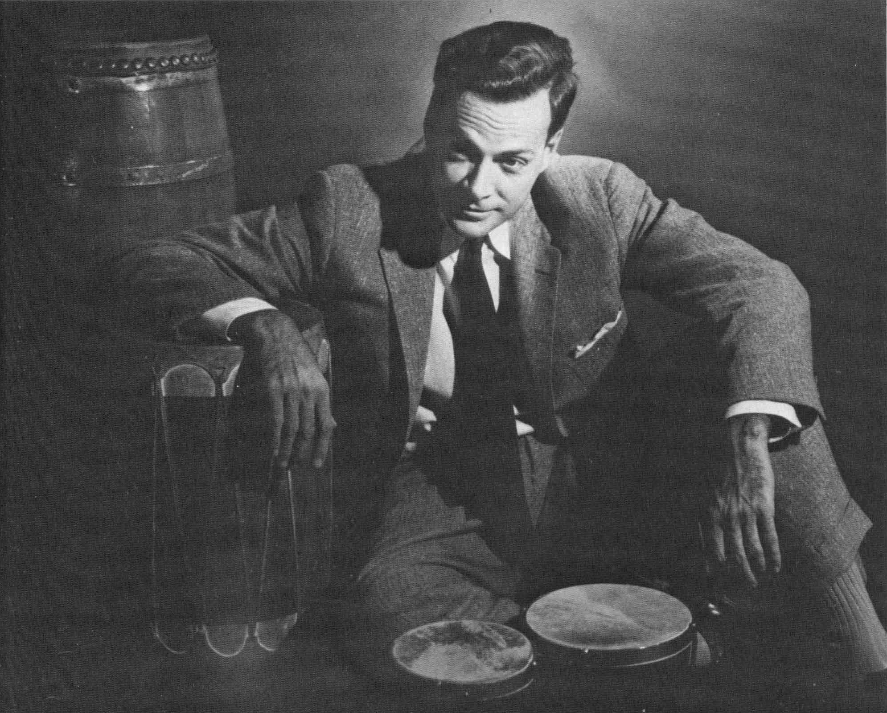

<!-- menu -->

|[Trang chủ](https://namlete102.github.io/Write-Collection-Mathematics/)|[Lưu trữ](https://namlete102.github.io/Write-Collection-Mathematics/archive.html)|[Thẻ](https://namlete102.github.io/Write-Collection-Mathematics/tag.html)|[Giới thiệu](https://namlete102.github.io/Write-Collection-Mathematics/about.html)|

<!-- title -->

    
        <h2>
            <b>"Nhà bác học", thiên tài và trí tưởng tượng</b> 
            <a href="#" target="_blank">(pdf)</a>
        </h2>
    

<!--  -->

    2024-11-14
    <a href="#" style="padding-right: 5px;">Vật lý</a>
    <a href="https://namlete102.github.io/Write-Collection-Mathematics/tag/collection.html" style="padding-right: 5px;">Sưu tập</a>
    <a href="https://namlete102.github.io/Write-Collection-Mathematics/tag/history.html" style="padding-right: 5px;">Lịch sử và góc nhìn</a>

<!-- contents -->

Vật lý? Với ai đó, chỉ cần sở hữu một trong các chức danh, phần thưởng kể trên cũng thừa đủ để nhấm nháp vinh quang suốt cả đời. Nhưng, với Feynman thì tất cả tước hiệu, phẩm bậc, phần thưởng chưa bao giờ là mục đích của đời ông. Feynman như một lãng tử suốt đời chìm trong đam mê: mê chơi trống, mê vẽ tranh, mê bẻ mã khoá, mê lý giải các ký tự của người Maya, mê ngồi ở các quán bar, mê kỹ thuật, mê giảng dạy, và đặc biệt là mê “chơi” vật lý. Ông gọi “nghiên cứu” là “chơi” – mà đã chơi thì phải hết mình. Richard Feynman là một thiên tài vật lý, là một anh hề, hay cả hai – như Freeman Dyson đã viết trong lời tựa cuốn bán tự truyện của Feynman – The pleasure of finding things out (bản tiếng Việt: Niềm vui khám phá, NXB Trẻ 2009). Đam mê, hài hước, hết mình và trung thực tuyệt đối, đó là những gì làm nên nhân cách Feynman. 

    

Nhà vật lý Richard Feynman. Nguồn ảnh: https://commons.wikimedia.org/wiki/File:Richard_Feynman_undated.png

Bài phỏng vấn với nhà vật lý Mỹ Richard Feynman vào cuối năm 1980 của tạp chí La Recherche , một tạp chí phổ biến khoa học nổi tiếng của Pháp. Bài phỏng vấn này đã được chọn là một trong những bài báo hay nhất và được đăng lại trong số đặc biệt kỷ niệm 30 năm thành lập của tạp chí này. Mặc dù bài viết đã lâu, nhưng những ý kiến của Feynman đến nay vẫn còn nguyên giá trị. Mình xin trân trọng gửi đến các bạn đọc bài phỏng vấn đó qua bản dịch của Phạm Văn Thiều  .

Thế nào là một nhà vật lý tốt?  Theo Richard Feynman, điều cơ bản không phải là nắm vững những công cụ toán học cần thiết mà phải luôn luôn giữ được óc phê phán, phải chấp nhận những điều bất ngờ không dự kiến trước và phải biết thừa nhận những sai lầm của mình mà không nản lòng.  

***P.V: Đối với những người ngoại đạo, vật lý năng lượng cao dường như có mục tiêu là phát hiện ra những thành phần tối hậu của vật chất. Theo đúng như đường hướng của khoa học cổ Hy Lạp, thì môn vật lý này giống như một cuộc “tìm kiếm nguyên tử”, tức là tìm kiếm hạt “không thể phân chia” được nữa. Tuy nhiên, các máy gia tốc lớn đã tạo ra những mảnh có khối lượng còn lớn hơn cả khối lượng của các hạt ban đầu, thậm chí của cả các hạt quark, những hạt mà ta không thể tách rời ra được. Vậy nói một cách chính xác thì các ông đang tìm kiếm cái gì ?***

***R. Feynman***:  Tôi không nghĩ rằng các nhà vật lý đã có một khi nào đó “tìm kiếm” một thành phần tối hậu của vật chất, họ chỉ cố gắng phát hiện ra hành trạng của Tự nhiên mà thôi. Họ có thể đã nói về “cái hạt tối hậu” đó mà chưa suy nghĩ thật kỹ, bởi vì ở một thời điểm nào đấy tự nhiên đối với họ có vẻ là như vậy, nhưng...thôi thế này vậy: Ông hãy thử hình dung một nhóm các nhà thám hiểm đang khám phá một lục địa mới. Bất chợt họ nhìn thấy nước chảy trên mặt đất. Vì họ đã từng nhìn thấy điều này ở quê nhà, họ gọi nó là “con sông” và quyết định khám phá nguồn của nó. Và thế là họ lần ngược dòng sông và mọi chuyện đều suôn sẻ cho tới thời điểm, khi đã leo lên đủ cao, họ nhận thấy rằng hệ thống thủy văn ở đây là hoàn toàn khác với điều mà họ chờ đợi. Có thể, nước chảy ra từ một hồ lớn hoặc từ một thác nước hoặc thậm chí con sông chảy thành một vòng tròn, thì sao ? Liệu ông có dám bảo rằng cuộc thám hiểm của họ là thất bại không ? Hoàn toàn không. Bởi lẽ mục đích đích thực của cuộc thám hiểm của họ là khám phá lục địa này kia mà. Và nếu cuối cùng họ vẫn không tìm được nguồn của con sông thì cũng có gì nghiêm trọng đâu, thậm chí họ có thể còn rất tiếc là mình đã nói quá sớm. Chừng nào mà Tự nhiên còn thể hiện cho chúng ta thấy nó giống như một hệ thống các bánh xe lồng trong nhau, thì việc tìm kiếm các bánh xe tối hậu cũng là chuyện bình thường thôi. Nhưng có thể Tự nhiên không được cấu trúc như vậy thì sao? Khi đó, cái mà chúng ta tìm kiếm sẽ là cái mà chúng ta tìm thấy, chấm hết.

***P.V: Dẫu sao thì các ông cũng có một ý niệm gì đấy, dù là nhỏ, về cái mà các ông sẽ tìm thấy chứ?***

***R. Feynman*** : Đúng thế...Nhưng điều gì sẽ xảy ra khi ông tới nơi sẽ chỉ có sương mù dày đặc ? Ông luôn luôn có thể hy vọng sẽ tìm thấy cái này hoặc cái kia, ông luôn luôn có thể phát biểu đủ thứ định lý này nọ về tôpô của các đường phân thủy, nhưng sẽ ra sao nếu ông lại rơi vào một màn sương mù dày đặc - nơi ngưng tụ các hình dáng rất mù mờ – và ông không thể phân biệt được đâu là trời đâu là đất ? Tất cả những lý thuyết đẹp đẽ của ông lúc đó sẽ sụp đổ ! Đấy chính là cuộc phiêu lưu mà chúng tôi lúc này lúc khác đã phải trải qua. Phải hết sức tự đắc mới dám khẳng định : “ Chúng tôi sẽ tìm thấy hạt tối hậu hoặc các định luật của trường thống nhất” hoặc bất cái gì đại loại như vậy. Thực tế, cái mà các nhà vật lý tìm thấy càng làm họ ngạc nhiên thì họ càng hài lòng. Ông có hình dung được một nhà vật lý nói rằng: “ Đó không phải là cái tôi đã dự tính trước: không hề có hạt tối hậu. Vậy thì tôi không muốn biết thêm gì nữa”. Chắc chắn là không ! “ Ôi lạy Chúa tôi, vậy thì đây là cái gì thế này ?” Đó chính là điều mà nhà vật lý sẽ nói.

***P.V :Vậy cái mà các ông hy vọng phải chăng chính là sự ngạc nhiên đó ?***

***R. Feynman*** : Dù tôi có hy vọng điều đó hay không cũng không làm thay đổi bản chất sự việc. Dẫu sao thì tôi cũng tìm thấy cái tôi tìm thấy. Người ta cũng không thể nói cần phải chờ đợi một sự bất ngờ trong mọi trường hợp được. Chẳng hạn, có một vài năm tôi rất dè dặt với các “lý thuyết trường chuẩn” vì tôi nghĩ rằng tương tác hạt nhân mạnh phải rất khác với tương tác điện từ, nhưng giờ đây hoàn toàn không phải như vậy. Nơi mà tôi chờ đợi là sẽ tìm thấy sương mù lại hiện ra với núi non và thung lũng.

***P.V : Những lý thuyết vật lý liệu có ngày càng trở nên trừu tượng hơn và toán học hơn không ? Liệu ngày hôm nay có còn chỗ đứng cho một nhà lý thuyết kiểu như Faraday ở đầu thế kỳ 19, nghĩa là anh ta không phải là nhà toán học ở trình độ cao nhưng lại có một trực giác vật lý mạnh mẽ ?*** 

    

Nhà vật lý, hóa học người Anh Michael Faraday

***R. Feynman*** : Tôi rất muốn nói rằng có rất ít khả năng ! Điều đó không phải bởi vì phải biết rất nhiều toán mới có thể hiểu được những cái đã được làm cho tới hiện nay. Hơn nữa, động thái của các hệ nội hạt nhân khác xa với những cái mà mà đầu óc chúng ta đã được tập dượt để tiếp nhận, khác tới mức sự phân tích chúng chỉ có thể là trừu tượng. Để hiểu một cục nước đá chẳng hạn, phải biết một lô thứ mà chẳng dính dáng gì đến cục nước đá đó cả. Những mô hình của Faraday, dựa trên các lò xo, dây dẫn và nhựa được bố trí trong không gian, về căn bản là cơ học và do đó có thể được biểu diễn bằng hình học sơ cấp. Tôi nghĩ rằng ngày hôm nay chúng ta đã hiểu được tất cả những gì có thể hiểu được bằng cách chấp nhận quan điểm đó. Nhưng những cái mà chúng ta đã phát minh ra trong vòng một trăm năm trở lại đây rất khác và rất mù mờ tới mức chỉ có toán học mới cho phép đưa chúng ta tiến lên được.

***P.V: Điều đó phải chăng có nghĩa là chỉ có một số rất ít người mới có khả năng tham gia vào sự tiến bộ của khoa học hoặc thậm chí đơn giản chỉ là hiểu được những cái đã làm ra ?***

***R. Feynman*** : Ít nhất thì hiện nay người ta cũng chưa tìm được phương tiện nào để tiếp cận các bài toán, làm cho chúng trở nên dễ hiểu hơn. Có lẽ chỉ cần dạy những vấn đề đó sớm lên chăng ? Ông biết đấy, nói toán học – một môn được mệnh danh là “trừu tượng” - rất khó là không thực đúng đâu. Hãy lấy ví dụ trường hợp lập trình trên máy tính chẳng hạn, nó cũng đòi hỏi một logic tinh tế lắm chứ. Nó cũng đã từng là loại công việc mà các bậc cha mẹ trước kia nghĩ rằng chỉ dành cho những bộ óc lớn. Thề mà ngày hôm nay nó đã trở thành một phần của đời sống hàng ngày và là một phương tiện kiếm sống như biết bao công việc khác. Chỉ cần con cái họ đặt tay vào chiếc máy tính là chúng sẽ mê mẩn ngay và sẽ rút ra từ đó đủ thứ điên rồ và tuyệt vời.

***P.V : Ấy là chưa kể những quảng cáo về các lớp dạy lập trình nhan nhản ở khắp nơi !***

***R. Feynman*** : Đúng như thế. Tôi không nghĩ rằng lại có, một bên, là một nhúm người kỳ dị có khả năng hiểu được toán học và, một bên, là những người bình thường. Toán học là một trong số những phát minh của nhân loại, do đó, về độ phức tạp, nó không thể vượt quá những cái mà con người có thể hiểu được. Một lần tôi có đọc trong một quyển sách về toán học một câu như thế này: “ Cái mà một gã điên làm ra thì những gã điên khác đều có thể làm được”. Các lý thuyết của chúng ta về Tự nhiên có vẻ như là trừu tượng và làm cho những người không được học chúng cảm thấy khiếp sợ, nhưng cũng không nên quên rằng những kẻ làm ra chúng là những gã điên khác. Cũng cần phải thông cảm với sự cường điệu, với khuynh hướng làm cho tất cả những lý thuyết đó đều quá sâu xa hơn là trên thực tế. Một lần khác, tôi với con trai – hồi đó cháu đang theo học triết học – cùng đọc một đoạn trong cuốn sách của Spinoza. Lập luận trong đó hoàn toàn chẳng có gì là cao siêu cả, nhưng nó lại được che đậy bằng một mớ những thuộc ngữ, những thực thể và các thứ tầm phào khác, đến nỗi sau một lát cả hai cha con tôi đều phì cười. Ông có thể cho rằng tôi nói hơi quá. Ai lại dám đi cười một nhà triết học tầm cỡ như Spinoza bao giờ! Nhưng ở đây Spinoza chẳng có lý do nào để biện minh cả. Vào cùng thời đó có Newton, có Harvey - người đã nghiên cứu sự tuần hoàn của máu -, có rất nhiều người mà nhờ các phương pháp phân tích của họ, khoa học đã phát triển. Ông cứ lấy bất cứ một mệnh đề nào của Spinoza và biến nó thành một mệnh đề có ý nghĩa ngược lại rồi quan sát xung quanh mình xem, tôi đố ông có thể nói được mệnh đề nào là đúng, mệnh đề nào là sai. Người ta cứ để mình bị huyễn hoặc vì Spinoza đã có dũng cảm tiếp cận những vấn đề quan trọng, nhưng thử hỏi ông ta dùng sự có dũng cảm ấy để làm gì nếu như nó chẳng mang lại kết quả nào ?

***P.V : Trong các sách giáo khoa nổi tiếng của ông, các nhà triết học và những lời bình luận của họ thường bị ông phê phán...***

***R. Feynman*** : Cái làm cho tôi không thể nào chịu được không phải là triết học mà là thứ thông thái rởm. Chỉ giá như các nhà triết học đừng lên mặt làm ra vẻ quá nghiêm trọng, chỉ giá như họ có thể nói thế này: “ Đó là điều tôi nghĩ, nhưng ngài A ngài B nào đó lại nghĩ khác và điều đó cũng khá đích đáng”. Nhưng không ! Họ lại lợi dụng thực tế là có thể không có hạt cơ bản tối hậu để khuyến khích chúng tôi cứ ở yên đó, và đây là cái mà họ nói một cách trịnh trọng: “ Tư duy của các anh

chưa đạt tới đủ độ sâu của sự vật, hãy để tôi cho các anh một định nghĩa vể thế giới trước đã”.Không đời nào ! Tôi đã quyết định dứt khoát là sẽ khám phá thế giới mà không cần tới cái định nghĩa đó của họ.

***P.V : Làm thế nào mà ông biết được bài toán này hay bài toán khác có thể bõ công để lao vào ?***

***R. Feynman*** : Ngay từ thời học trung học tôi đã có ý niệm rằng cần phải nhân tầm quan trọng của một bài toán với xác suất giải được nó. Đó chính là loại ý tưởng nên gieo vào đầu óc của một đứa bé có thiên hướng kỹ thuật, vì đối với nó tất cả đều phải có thể được tối ưu hoá . Trong bất cứ hoàn cảnh nào, khi người ta biết kết hợp hai yếu tố đó (tức tầm quan trọng của bài toán và khả năng giải được nó - ND) một cách thích hợp thì người ta sẽ không tiêu phí đời mình để húc đầu vào một bài toán mà mình không thể giải được cũng như không hơi đâu đi giải những bài toán nhỏ nhoi mà những người khác cũng có thể làm được.

***P.V : Hãy lấy ví dụ về trường hợp bài toán mà ông đã được giải Nobel cùng với Schwinger và Tomonaga, các ông mỗi người đã tiếp cận nó một cách khác nhau. Vậy có phải bài toán đó đã đến lúc đặt biệt chín mùi hay không?***

***R. Feynman*** : Điện động lực học lượng tử đã được Dirac và một số người khác phát minh vào cuối những năm 1920, chỉ ít lâu sau khi Cơ học lượng tử ra đời. Về căn bản, lý thuyết của họ là đúng, nhưng khi tiến hành tính toán thì họ vấp phải những phương trình rất phức tạp và khó giải. Phép gần đúng bậc nhất thì ngon lành không có vấn đề gì, nhưng khi định tìm kết quả chính xác hơn bằng cách tính thêm những hiệu chỉnh bậc cao thì họ lại làm xuất hiện những đại lượng vô hạn, cái mà người ta gọi là “các phân kỳ”. Trong suốt 20 năm, đây là một thực tế phổ biến tới mức người ta có thể tìm thấy trong bất cứ cuốn sách nào về lý thuyết lượng tử.

Chính khi đó Lamb và Rutherford đã công bố các kết quả đo của mình về sự dịch của các mức năng lượng của electron trong nguyên tử hiđrô. Trước đấy, người ta có thể hài lòng với những đánh giá thô của lý thuyết, nhưng giờ đây phải đối mặt với một con số rất chính xác. Hình như là một ngàn sáu mươi mêga Héc hay đại loại như vậy. Và ai cũng có chung một ý nghĩ: “ Cần phải giải quyết cái bài toán quái quỷ này.”

Xuất phát từ giá trị thực nghiệm đó, Hans Bethe đã tiến hành một cách tính nhanh, trong đó ông sắp xếp sao cho hiệu ứng này bù trừ cho hiệu ứng kia để thử khử đi các phân kỳ, những số hạng có xu hướng tăng vô hạn sẽ bị chặn lại bằng cách như vậy ở một giá trị dường như chấp nhận được. Và ông đã thu được con số xấp xỉ một ngàn mêga Héc. Tôi nhớ là ông đã cho mời một số người đến chỗ ông ở Corneil, nhưng vì phải vắng mặt do công chuyện, ông đã gọi điện thoại cho chúng tôi và chia sẻ với tôi về những ý tưởng mà ông vừa nảy ra trong lúc ngồi trên tàu hoả. Sau khi trở về ít lâu, ông có giảng cho chúng tôi về vấn đề này, trong đó ông đã chỉ cho chúng tôi cách làm thế nào để tránh đươc các phân kỳ bằng thủ tục vừa nói ở trên. Nhưng vì tất cả vẫn còn quá mù mờ và có vẻ hơi tùy tiện, nên ông nói với chúng tôi rằng sẽ rất tốt nếu có ai đó làm lại lại chuyện này một cách thật đàng hoàng. Vào cuối buổi học, tôi tìm gặp ông và nói: “ Cũng dễ thôi! Tôi biết cách làm rồi”. Và ông thấy đấy, tôi đã bắt tay nghiên cứu vấn đề đó ngay từ năm học cuối cùng của tôi ở MIT (Massachuset Institute of Technology – một trong số những trường đại học nổi tiếng nhất của Mỹ - ND). Ngay thời gian đó, tôi thậm chí còn biên soạn xong cả một lời giải nhưng ...tất nhiên là sai ! Sự đóng góp của chúng tôi, gồm Schwinger, Tomonaga và tôi, là ở chỗ tìm ra được một phương cách biến thủ tục của Bethe thành một phương pháp tính chặt chẽ, hay nói theo thuật ngữ chuyên môn là thoả mãn được yêu cầu bất biến tương đối từ đầu đến cuối. Tomonaga đã chỉ ra được một phương pháp khả dĩ, Schwinger thì đang xây dựng một phương pháp khác. Còn tôi tới gặp Bethe để trình với ông phương riêng của mình. Điều khôi hài là lúc đó tôi không làm sao giải được cụ thể một bài toán thực tế, dù là đơn giản nhất trong lĩnh vực đó. Lẽ ra tôi phải tập làm điều đó trước đã mới phải, nhưng tôi lại quá bận tâm về lý thuyết riêng của mình...Nói một cách ngắn gọn là tôi không thể thấy những ý tưởng của mình có ổn hay không. Bethe và tôi cùng nhau tính ngay trên bảng...và chúng tôi đã không tìm được kết quả đúng. Thậm chí còn tồi tệ hơn cả trước. Tôi trở về nhà và quyết định phải tập luyện trên các ví dụ. Sau khi làm thử như thế, tôi trở lại gặp Bethe và chúng tôi lại cùng nhau tính lại, và lần này thì mọi chuyện ... thật tốt đẹp. Chúng tôi không bao giờ hiểu được lần đầu tiên chúng tôi đã phạm sai lầm ở đâu. Có thể là một lỗi ngớ ngẩn nào đó cũng nên...

--- 

<!-- footer -->

    <a href="https://github.com/Namlete102/Write-Collection-Mathematics" target="_blank" style="padding-right: 2px;">Github</a>
    .
    <a href="https://namlete102.github.io/Namleteblog.github.io/" target="_blank" style="padding-left: 2px;">Liên hệ</a>

