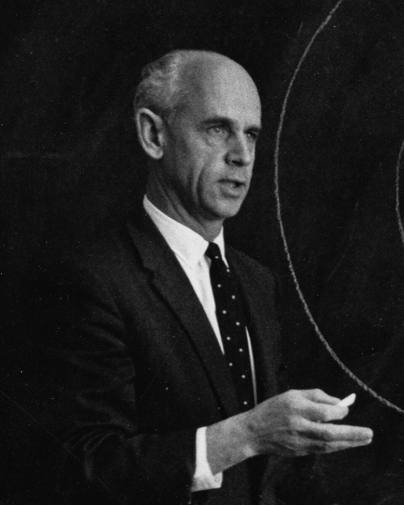
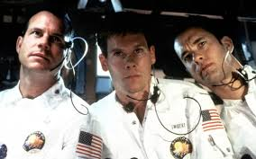

<!-- menu -->

|[Trang chủ](https://namlete102.github.io/Write-Collection-Mathematics/)|[Lưu trữ](https://namlete102.github.io/Write-Collection-Mathematics/archive.html)|[Thẻ](https://namlete102.github.io/Write-Collection-Mathematics/tag.html)|[Giới thiệu](https://namlete102.github.io/Write-Collection-Mathematics/about.html)|

<!-- title -->

    
        <h2>
            <b>Why explore space - Tại sao chúng ta lại khám phá không gian</b> 
            <a href="#">pdf</a>
        </h2>
    

<!--  -->

    2024-12-14
    <a href="https://namlete102.github.io/Write-Collection-Mathematics/tag/physics.html" style="padding-right: 5px;">Vật lý</a>
    <a href="https://namlete102.github.io/Write-Collection-Mathematics/tag/collection.html" style="padding-right: 5px;">Sưu tập</a>
    <a href="https://namlete102.github.io/Write-Collection-Mathematics/tag/history.html" style="padding-right: 5px;">Lịch sử và góc nhìn</a>

<!-- contents -->

Sau những thành tựu đỉnh cao của các sứ mệnh Mặt trăng Apollo — đưa con người lên Mặt trăng và thực hiện các thí nghiệm khoa học mang tính cách mạng cung cấp thêm manh mối để mô tả sự hình thành của hệ mặt trời. Nhiều người vẫn không tin rằng những nỗ lực hỗ trợ các cuộc thám hiểm như vậy trong tương lai ở biên giới cuối cùng là xứng đáng với chi phí đầu tư. Thật vậy, thế giới đang bị tàn phá bởi đói nghèo, nạn đói, thiên tai, v.v., vậy tại sao con người phải chi tiêu xa hoa cho nghiên cứu khoa học khi số tiền đó có thể được chuyển hướng cho các mục đích nhân đạo?

Đây là quan điểm được bà Mary Jucunda, một nữ tu làm việc tại Zambia khi Apollo bắt đầu đổ bộ lên Mặt Trăng, đưa ra. Bực tức khi thấy NASA chi hàng tỷ đô la để phát triển công nghệ mà một ngày nào đó sẽ đưa con người lên Mặt Trăng. Năm 1970, sơ Jucunda đã viết một lá thư cho Ernst Stuhlinger , khi đó là Phó giám đốc khoa học của NASA tại Trung tâm Bay không gian Marshall, để bày tỏ sự không hài lòng về việc ông liên tục thúc đẩy phát triển các dự án khám phá không gian mà quên mất đi nhiều trẻ em trên thế giới còn đang phải chết đói.

Stublinger sau đó gửi một bức thư trả lời cho sơ Jucunda đi kèm vói “Earthrise”, một bức ảnh biểu tượng về Trái Đất được chụp từ Mặt Trăng vào năm 1968 bởi phi hành gia William Anders. Bức thư trả lời đầy tâm huyết của ông sau đó được NASA đăng lên website chính thức với tiêu đề 

**“Tại sao lại phải khám phá không gian?”** 

Ngày 6/5/1970

Kính gửi sơ Mary Jucunda,

Lá thư của sơ là một trong rất nhiều lá thư được gửi đến tôi mỗi ngày, nhưng nó đã khiến tôi cảm động nhiều hơn bất kỳ lá thư nào khác bởi vì nó được viết ra bởi một cái đầu luôn tìm tòi và một trái tim đầy lòng trắc ấn. Tôi sẽ cố gắng trả lời bức thư của sơ bằng tất cả khả năng mà mình có thể.

Lời đầu tiên cho phép tôi được tỏ lòng ngưỡng mộ sâu sắc của mình đối với sơ, và với rất nhiều những sơ khác, bởi vì mọi người đang hy sinh cuộc sống của mình cho nghĩa cửa cao đẹp nhất: ra tay giúp đỡ những người anh em đang trong hoạn nạn.

Trong lá thư của mình, sơ hỏi tôi rằng làm sao tôi có thể chấp nhận việc tiêu phí hàng tỉ đô la vào các chương trình khám phá Sao Hỏa, tại thời điểm mà có biết bao trẻ em trên Trái Đất còn đang phải chết vì đói. Tôi biết rằng sơ sẽ không chấp nhận một câu trả lời đại loại như ***"Ồ, tôi đâu có biết trẻ em trên Trái Đất đang phải chết vì không có thức ăn, nhưng từ bây giờ tôi sẽ dừng tất cả những nghiên cứu về không gian cho tới khi nhân loại xử lý được vấn đề này”***. Trên thực tế, bản thân tôi đã biết rõ về các nạn đói xảy ra đối với trẻ em rất lâu trước khi tôi biết rằng việc du hành tới Sao Hỏa là một thứ gì đó khả thi. Tuy nhiên, tôi, cũng như rất nhiều những người bạn của tôi, tin rằng việc khám phá Mặt Trăng, sau đó là Sao Hỏa và các hành tinh khác là một nhiệm vụ mà chúng ta cần phải thực hiện ngay bây giờ, và tôi thậm chí tin rằng dự án này, về lâu dài, sẽ đóng một vai trò quan trọng trong việc góp phần xử lý những vấn đề nghiêm trọng mà chúng ta đang gặp phải trên Trái Đất, quan trọng hơn rất nhiều những dự án tiềm năng khác đang được tranh luận năm này qua năm khác khiến chúng vô cùng chậm chạp trong việc đạt được một kết quả khả quan.

    

    <b>Ernst Stublinger (1913 - 2008) là một nhà khoa học nguyên tử, điện và tên lửa người Mỹ gốc Đức </b>

Trước khi đi vào giải thích chi tiết những chương trình không gian của chúng tôi có thể đóng vai trò như thế nào trong việc xử lý các vấn đề lớn mà Trái Đất đang gặp phải, tôi muốn đưa ra một ví dụ, một câu truyện có thật như một chứng minh cho những luận điểm của mình.

Khoảng 400 năm trước, có một vị bá tước sống trong một thành phố nhỏ tại Đức. Vị bá tước này là một người rất tốt, và ông sử dụng hầu hết của cải của mình để giúp đỡ những người nghèo ở đó. Vào thời trung cổ, dịch bệnh và tai ương thường xuyên ập xuống khiến người dân nghèo lại càng nghèo, nên hành động của vị bá tước  cùng được lòng người dân trong thành phố. Một ngày nọ, vị bá tước gặp một người đàn ông kỳ lạ. Anh ta có một phòng thí nghiệm nhỏ trong nhà mình. Ban ngày, anh ta làm việc rất chăm chỉ để có thể dành vài tiếng vào buổi tối thực hiện những thí nghiệm trong đó. Anh tạo ra những thấu kính nhỏ từ những mảnh kính, rồi đặt những thấu kính đó vào trong các ống dài, và dùng thiết bị mà mình tạo ra để nhìn ngắm những vật rất nhỏ. Vị bá tước tỏ ra rất thích thú khi thấy những sinh vật nhỏ li ti có thể quan sát được nhờ khả năng phóng đại của thiết bị này mà ông chưa bao giờ thấy trước đây. Vị bá tước này liền mời người đàn ông nọ vào sống trong lâu đài của mình, tất nhiên là cùng với phòng thí nghiệm nhỏ của anh, để trở thành một trong những người trong gia đình của ông, và để anh có thể giành toàn bộ thời gian của mình phát triển và hoàn thiện thiết bị mà mình đã tạo ra.

Tuy nhiên, những người dân ở đó lại trở nên giận dữ, vì họ nghĩ rằng vị bá tước đang lãng phí tiền của vào một thứ mà chẳng có mục đích gì.

    
“Chúng ta đang phải chịu đựng những tai ương này,”

họ nói,

***"Trong khi ông ta trả tiền cho một gã với thứ sở thích vô dụng!"***

Nhưng vị bá tước vẫn rất cương nghị.

***"Tôi cho mọi người tất cả những gì tôi có thể",***

ông nói,

***"Nhưng tôi vẫn sẽ giúp đỡ người đàn ông này và những gì anh ta đang làm, bởi vì tôi biết rằng anh ta sẽ tạo ra một thứ gì đó hữu ích trong tương lai!"***

Đúng vậy, một phát minh đã được sinh ra từ đó: chiếc kính hiển vi. Một điều hiển nhiên là kính hiển vi đã đóng một vai trò lớn hơn bất kỳ phát minh nào khác vào sự phát triển của y học, và chính phát minh này đã giúp việc nghiên cứu và ngăn chặn rất nhiều dịch bệnh lây nhiễm trên thế giới trong quá khứ trở nên khả thi.

Như vậy, bằng cách sử dụng một phần tài sản của mình cho việc nghiên cứu và khám phá, vị bá tước đã đóng góp cho nhân loại lớn hơn rất nhiều so với việc ông chỉ dùng tài sản của mình để cứu giúp những người nghèo trong thành phố.

Hoàn cảnh mà chúng ta đang phải đối mặt ngày nay giống với câu chuyện trên ở rất nhiều khía cạnh. Tổng thống Hoa Kỳ mỗi năm tiêu tốn hết khoảng 200 tỉ đô la. Số tiền này được sử dụng cho các mục đích như sức khỏe, giáo dục, phúc lợi xã hội, cải cách đô thị, làm đường, vận chuyển, cứu trợ quốc tế, phòng thủ, bảo tồn, khoa học, nông nghiệp và rất nhiều các đầu mục khác trong cũng như ngoài nước. Trong năm nay, khoảng 1.6% số tiền này được cấp cho việc khám phá không gian. Chương trình không gian bao gồm Dự án Apollo và rất nhiều các dự án nhỏ hơn khác trong các mảng vật lý không gian, thiên văn học không gian, sinh học không gian, các dự án hành tỉnh, các dự án về tài nguyên Trái Đất và kỹ thuật không gian. Để có thể giúp trang trải chi phí cho những chương trình này, một người Mỹ trung bình với thu nhập khoảng 10.000 đô la mỗi năm đang đóng khoảng 30 đô la cho các chương trình không gian. Phần thu nhập còn lại, 9970 đô la, được dùng để trang trải các sinh hoạt phí, giải trí, tiết kiệm, các loại thuế và chi phí khác của anh ta/cô ta.

Bây giờ có lẽ sơ sẽ hỏi,

    “Tại sao ông không lấy 3 hoặc 5 đô hay thậm chí 1 đô la từ số tiền 30 đô la mà một người Mỹ đang đóng đó để ủng hộ cho những trẻ em đang chết đói?" 

Để trả lời câu hỏi này, tôi sẽ phải giải thích cho sơ một cách ngắn gọn về cách thức hoạt động của nền kinh tế đất nước này. Có lẽ mọi thứ cũng tương tự ở các quốc gia khác. Chính quyền của một quốc gia sẽ bao gồm nhiều ban ngành ( Tư pháp, Y tế, Giáo dục, Giao thông, Quân đội, ... ) và phòng ban, tổ chức khác nhau (Viện Khoa học Quốc gia, Học viện Chính trị Quốc gia, ... ). Tất cả những ban ngành, tổ chức này sẽ phải chuẩn bị để đề xuất ngân sách hàng năm dựa trên các nhiệm vụ mà mỗi ban ngành, tổ chức được giao. Sau đó, mỗi ban ngành, tổ chức sẽ phải trình bày và bảo vệ những đề xuất này dưới sự xem xét sát sao của Quốc hội, cũng như áp lực rất lớn về mục đích kinh tế trước Cục Ngân sách Quốc gia và Tổng thống. Sau khi ngân sách này được chấp thuận bởi Quốc hội, họ chỉ có thể sử dụng tiền vào những danh mục đã được chấp thuận.

Ngân sách của Cơ quan Hàng không và Vũ trụ Quốc gia theo đó cơ bản chỉ có thể được sử dụng vào những mục đích có liên quan tới hàng không và vũ trụ. Nếu như ngân sách cho một đầu mục nào đó không được quốc hội thông qua, số tiền được đề xuất cho đầu mục đó sẽ không được sử dụng cho những mục đích khác, số tiền đó sẽ không bị đánh thuế lên người dân, trừ khi một đầu mục nào đó được phê chuẩn tăng lên và sử dụng luôn ngân sách cho đầu mục chưa được thông qua ở trên. Từ phần giải thích này, có lẽ sơ đã hiểu nguồn ngân sách hỗ trợ cho trẻ em nghèo, hay ngân sách hỗ trợ cho bất kỳ một mục đích cao cả nào đó dưới danh nghĩa hỗ trợ quốc tế, sẽ chỉ có thể được thông qua khi một tổ chức, phòng ban nào đó đề xuất nó và sau đó được xem xét gắt gao và phê chuẩn của Quốc hội

Bây giờ sơ có thể hỏi

    "Liệu Chính phủ có sẵn lòng ủng hộ tôi thực hiện việc đó hay không ?"

Tôi muốn nhấn mạnh câu trả lời là có. Thực sự, tôi chẳng hề phiền lòng chút nào nếu mức thuế mà tôi phải đóng hàng năm tăng lên đôi chút cho mục đích giúp trẻ em nghèo có thêm vài bữa ăn, dù chúng sống ở đâu đi chăng nữa.

Tôi biết rằng tất cả bạn bè của tôi cũng cảm thấy như vậy. Tuy nhiên, chúng tôi không thể đưa những chương trình như vậy vào thực tế chỉ đơn giản bằng cách ngừng các kế hoạch khám phá Sao Hỏa. Ngược lại, tôi thậm chí tin rằng bằng cách tập trung sức lực và tinh thần vào các chương trình không gian, tôi có thể đóng góp nhiều hơn vào việc giải quyết nạn đói nghèo mà chúng ta đang gặp phải trên Trái Đất. Về cơ bản, việc giải quyết nạn đói bao gồm hai phần: sản xuất thức ăn và phân phối thức ăn. Việc sản xuất thức ăn bằng nông nghiệp, chăn thả gia súc, đánh bắt cá và các phương pháp với quy mô lớn khác thường sẽ có hiệu quả cao ở một số nơi trên thế giới nhưng lại rất kém hiệu quả ở những nơi khác. Ví dụ, một khoảng đất rộng lớn sẽ được sử dụng một cách tối ưu hơn rất nhiều nếu như các biện pháp hiệu quả về kiểm soát lưu vực, phân bón, dự báo thời tiết, đánh giá độ màu mỡ, thói quen nuôi trồng, thời gian canh tác, theo dõi vụ mùa cũng như thu hoạch được áp dụng.

Công cụ tốt nhất để cải tiến tất cả những thứ đó không có gì bàn cãi chính là các vệ tinh nhân tạo. Bay quanh Trái Đất ở độ cao rất lớn, chúng có thể theo dõi một diện tích đất khổng lồ trong một thời gian ngắn, chúng có thể quan sát và đánh giá số lượng lớn các nhân tố khác nhau có thể ảnh hưởng tới mùa màng, đất đai, hạn hán, mưa, tuyết và sau đó gửi các thông tin này tới các trạm mặt đất để xử lý và đưa ra các phương án phù hợp. Thực tế chỉ ra rằng chỉ một hệ thống vệ tinh đơn giản bao gồm các cảm biến đang chạy trong một chương trình nông nghiệp đã có thể tăng sản lượng vụ mùa hàng năm lên tới con số hàng tỉ đô la.

Việc phân phối thức ăn tới những người cần chúng lại là cả một vấn đề hoàn toàn khác. Câu hỏi không chỉ đơn giản là về khối lượng vận chuyển, mà về khả năng hợp tác quốc tế. Chính quyền của một quốc gia nhỏ bé sẽ không cảm thấy dễ chịu khi có một lượng lớn thức ăn được vận chuyển qua quốc gia của họ bởi một quốc gia lớn hơn, đơn giản bởi vì họ sợ rằng ngoài thức ăn, những thứ đi kèm khác sẽ bao gồm cả sức ảnh hưởng cũng như sức mạnh của ngoại bang. Tôi e ngại rằng việc giúp đỡ những người nghèo khó sẽ không thể trở nên hiệu quả nếu như ranh giới giữa các quốc gia còn đang bị chia cắt như ngày nay. Tôi cũng không tin rằng các chuyến bay không gian cũng làm được điều này ngay lập tức. Tuy nhiên, các chương trình không gian chính là một trong những phương pháp đầy triển vọng đang thực hiện để đạt được điều đó.

Tôi muốn kể cho sơ về sự cố tàu Apollo 13 vừa rồi. Trong thời khắc quyết định lúc các phi hành gia của chúng ta chuẩn bị trở về, Liên bang Xô Viết đã chủ động  toàn bộ các tín hiệu radio trong tần số được sử dụng bởi Chương trình Apollo để tránh khả năng xảy ra bất kỳ sự nhiễu sóng nào, và các tàu của họ túc trực sẵn trên Thái Bình Dương và Đại Tây Dương để sẵn sàng tương trợ nếu có bất cứ sự cố nào xảy ra với phi hành đoàn. Nếu như tàu của chúng ta hạ cánh gần một trong những chiếc tàu của Liên Xô, chắc chắn một điều rằng họ sẽ giành tất cả sự quan tâm chăm sóc tốt nhất cho các phi hành gia của chúng ta như thể họ chăm sóc cho các phi hành gia của chính Liên bang Xô Viết vừa trở về từ vũ trụ. Mỹ cũng vậy, chúng tôi sẽ không ngần ngại làm điều tương tự cho các phi hành gia của họ nếu như họ không may gặp phải tình huống tương tự.

    

    <b>Một cảnh phim Apollo 13 (1995)</b>

Năng suất lương thực cao hơn nhờ theo dõi và đánh giá từ quỹ đạo, và khả năng phân phối lương thực tốt hơn nhờ vào mối quan hệ chặt chẽ và tốt đẹp giữa các quốc gia, chỉ là hai ví dụ trong việc những chương trình không gian có thể gây ảnh hưởng mạnh mẽ tới cuộc sống trên Trái Đất của chúng ta như thế nào. Tôi muốn lấy thêm hai ví dụ khác: kích thích sự phát triển của công nghệ và khả năng sản sinh ra các tri thức khoa học.

Chưa bao giờ trong lịch sử của ngành kỹ thuật chúng ta phải đưa ra các yêu cầu về tính chính xác cao và độ ổn định tuyệt đối đến như thế với những thành phần của một con tàu vũ trụ. Việc phát triển những hệ thống đòi hỏi những yêu cầu khắt khe như vậy đã cho chúng tôi một cơ hội tuyệt vời để tìm ra những vật liệu và phương pháp mới, để phát minh ra những hệ thống kỹ thuật tốt hơn, để tạo ra những quy trình, để tăng tuổi thọ của các thiết bị, và thậm chí để khám phá ra những định luật vũ trụ mới.

Tất cả những kiến thức kỹ thuật mới này đều có thể được áp dụng cho các sản phẩm dưới mặt đất. Mỗi năm, hàng ngàn những phát mình trong các chương trình không gian được nhìn thấy trong những ngành khác, giúp cho con người có được những công cụ làm bếp tốt hơn, những máy móc tốt hơn cho việc đồng áng, máy may quần áo tốt hơn, vô tuyến tốt hơn, tàu bè và máy bay tốt hơn, khả năng dự báo thời tiết và bão lũ tốt hơn, các kênh liên lạc tốt hơn, các thiết bị y tế tốt hơn và các công cụ thiết yếu khác cho đời sống của chúng ta. Tôi cho rằng lúc này sơ sẽ tiếp tục thắc mắc,

    Tại sao chúng ta phải phát triển hẳn một hệ thống hỗ trợ sự sống cho các phi hành gia trên mặt trăng, trước khi chúng ta có thể xây dựng một hệ thống cảm biến từ xa cho các bệnh nhân bị bệnh tim mạch? 

Câu trả lời rất đơn giản: sự đột phá trong việc tìm kiếm các giải pháp cho những vấn đề hóc búa thường không xuất hiện bằng các phương pháp trực tiếp, nhưng lại bằng cách đặt ra mục tiêu giải quyết những thử thách lớn hơn. Những thử thách này sẽ là động lực mạnh mẽ buộc phải tạo ra những cách làm tân tiến, làm nhiên liệu thúc đẩy con người phải cố gắng hết sức mình, và chính điều đó là chất xúc tác để tạo ra một loạt các phản ứng khác, mà kết quả là những phát minh vĩ đại mà chúng ta đang sử dụng.

Các chuyến bay vào vũ trụ hiển nhiên là đang đóng vai trò như vậy. Những chuyến hành trình khám phá Sao Hỏa tất nhiên sẽ không phải là nguồn cung cấp thực phẩm trực tiếp cho những người nghèo đói. Tuy nhiên, bản thân nó sẽ là nguồn gốc của vô vàn những phát minh quan trọng khác mà giá trị mang lại sẽ gấp nhiều nhiều lần cái giá phải trả để thực hiện dự án này.

Ngoài nhu cầu về các công nghệ mới, việc tìm ra các kiến thức cơ bản mới cũng là điều vô cùng cấp thiết cho việc nâng cao điều kiện sống của con người trên Trái Đất. Chúng ta cần nhiều kiến thức hơn trong các lĩnh vực vật lý và hóa học, trong sinh học hay sinh lý học, và đặc biệt là về dược phẩm để đối phó với những nguy cơ gây hại cho đời sống con người: đói khát, bệnh tật, sự nhiễm bẩn thức ăn và nguồn nước, ô nhiễm môi trường.

Chúng ta cần nhiều hơn những con người lựa chọn khoa học làm mục tiêu nghề nghiệp, và chúng ta cần hỗ trợ tốt hơn cho những nhà khoa học này, những con người tài năng và quyết tâm theo đuổi việc nghiên cứu. Những chủ đề nghiên cứu khó sẽ phải được đưa ra, và cần phải có đầy đủ sự hỗ trợ cho các dự án nghiên cứu này. Cũng vậy, những chương trình không gian với đầy rẫy những cơ hội tuyệt vời cho phép các nhà khoa học có thể tiếp cận được với những chủ đề nghiên cứu rộng lớn về Mặt Trăng và các hành tinh, về vật lý và thiên văn học, về sinh học và dược phẩm chính là chất xúc tác lý tưởng cho phép tạo ra những phản ứng về động lực cho phép làm khoa học, cơ hội được chiêm ngưỡng những điều kỳ thú của tự nhiên, và những hỗ trợ cần thiết để có thể thực hiện được những nghiên cứu đó.

Trong tất cả những dự án được định hướng điều khiển và cấp ngân sách bởi chính phủ Hoa Kỳ, chương trình không gian chắc chắn là dự án được nhiều người biết đến nhất, và có lẽ nó là dự án được tranh luận nhiều nhất, mặc dù nó chỉ chiếm 1.6% tổng ngân khố quốc gia, và chỉ chưa đến 0.3% tổng sản lượng quốc gia. Nếu xét về vai trò như một chất kích thích và xúc tác trong việc phát triển những công nghệ mới và nghiên cứu khoa học cơ bản, thực sự chẳng có dự án nào có thể sánh ngang được với chương trình không gian.

Bao nhiêu hy sinh và mất mát có thể sẽ không xảy ra nếu như các quốc gia thay vì đối chọi nhau về tên lửa và máy bay ném bom, thì họ đối chọi nhau về các tàu vũ trụ khám phá không gian! Cuộc chiến này đây hứa hẹn về những chiến thắng vinh quang, nhưng hậu quả mà nó để lại không phải là số phận cay đắng của những kẻ chiến bại, những thứ nuôi dưỡng thù hận và chiến tranh triền miễn.

Mặc dù chương trình không gian dường như đang kéo chúng ta khỏi Trái Đất thân yêu về phía mặt trăng, mặt trời, các hành tỉnh và các vì sao, tôi tin rằng không một thiên thế nào trong số chúng sẽ thu hút được sự chú ý và nghiên cứu bởi các nhà khoa học không gian bằng hành tinh xanh này. Trái Đất sẽ trở thành một Trái Đất xanh và đẹp hơn, không phải chỉ vì những công nghệ và kiến thức khoa học mới mà chúng ta đã, đang và sẽ ứng dụng để làm cho cuộc sống tốt hơn, mà còn bởi vì chúng ta đang tạo ra những sự tôn trọng sâu sắc hơn về hành tinh của chúng ta, về sự sống, và về con người.

    

    <b>Earthrise, chụp bởi William Anders trên chuyến bay Apollo 8, ngày 24/12/1968 khi đang bay trên quỹ đạo quanh Mặt Trăng</b>

Bức ảnh mà tôi đính kèm trong lá thư này là hình ảnh của Trái Đất được chụp bởi tàu Apollo 8 khi nó đang bay vòng quanh Mặt Trăng vào Giáng sinh năm 1968. Trong số tất cả những thành tựu tuyệt vời mà chúng ta đã đạt được trong chương trình không gian, bức ảnh này có lẽ là kết quả quan trọng nhất. Nó mở mắt chúng ta và khiến chúng ta nhận ra rằng Trái Đất này là thứ quý giá và đẹp đẽ nhất trong một cõi hư không vô tận, rằng sẽ chẳng có bất kỳ nơi nào khác mà chúng ta có thể sinh sống ngoài bề mặt mỏng manh của hành tinh này, nơi được bao phủ bởi một không gian bất tận và ảm đạm. Chưa có bao giờ chúng ta nhận ra Trái Đất này lại nhỏ bé đến như vậy và thật nguy hiểm biết bao nếu sự cân bằng sinh thái của nó bị xáo trộn. Từ khi bức ảnh này được công bố, những cảnh báo ngày càng xuất hiện nhiều và lớn hơn về các vấn đề nghiêm trọng mà chúng ta đang phải đối mặt ngày nay: ô nhiễm, đói khát, thiếu thốn, cuộc sống thành thị, sản xuất thực phẩm, quản lý nguồn nước, bùng nổ dân số. Chắc chắn không phải ngẫu nhiên khi việc chúng ta chỉ bắt đầu cảm thấy những nhiệm vụ to lớn đang chờ đợi ở phía trước khi ngành không gian non trẻ lần đầu tiên cho chúng ta một cái nhìn tổng quan về hành tinh này.

Một điều đáng mừng là ngành không gian non trẻ không chỉ cho chúng ta một chiếc gương để mỗi người có thể tự nhìn thấy chính mình, nó còn đem đến cho chúng ta công nghệ, thách thức, động lực, và thậm chí với cả sự lạc quan để xử lý những vấn đề này một cách tự tin nhất. Tôi tin rằng những gì mà chúng ta học được trong chương trình không gian là một minh chứng cụ thể cho những ý nghĩa tồn tại trong câu nói của Albert Schweitzer:

***"Tôi nhìn về tương lai với rất nhiều lo lắng, nhưng cũng với rất nhiều hy vọng tươi đẹp."*** 

Tôi luôn chúc cho những điều tuyệt vời nhất sẽ đến với sơ, và với những đứa trẻ của sơ.

Thân ái,

Ernst Stuhlinger.

Phó Giám đốc Khoa học

---

<!-- footer -->

    <a href="https://github.com/Namlete102/Write-Collection-Mathematics" target="_blank" style="padding-right: 2px;">Github</a>
    .
    <a href="https://namlete102.github.io/Namleteblog.github.io/" target="_blank" style="padding-left: 2px;">Liên hệ</a>

